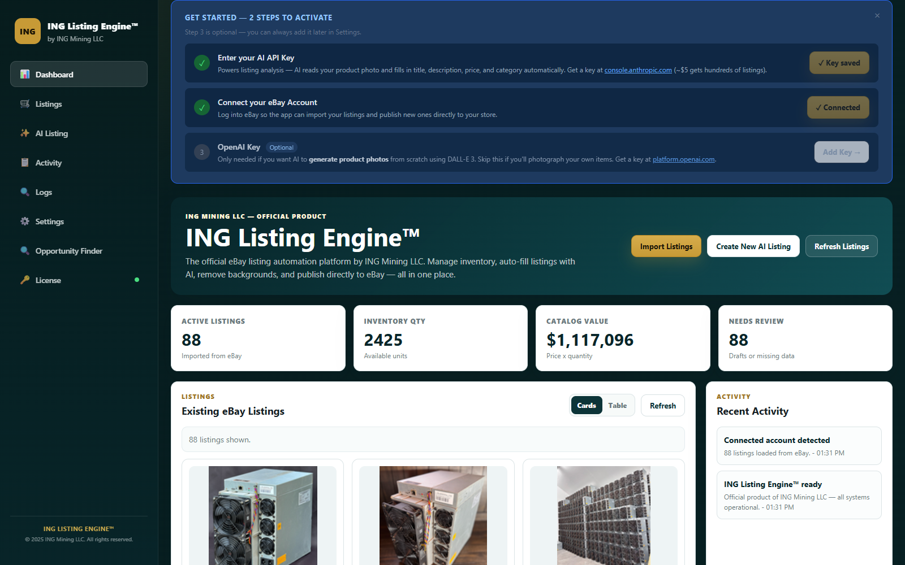
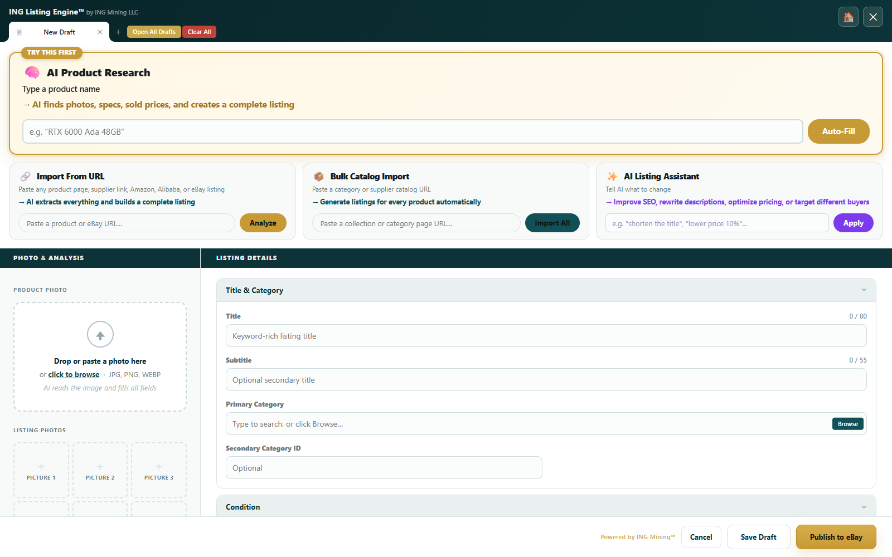
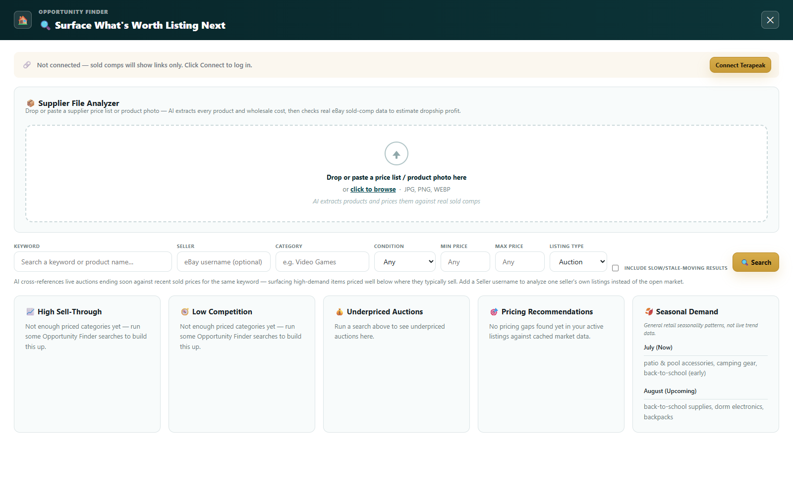
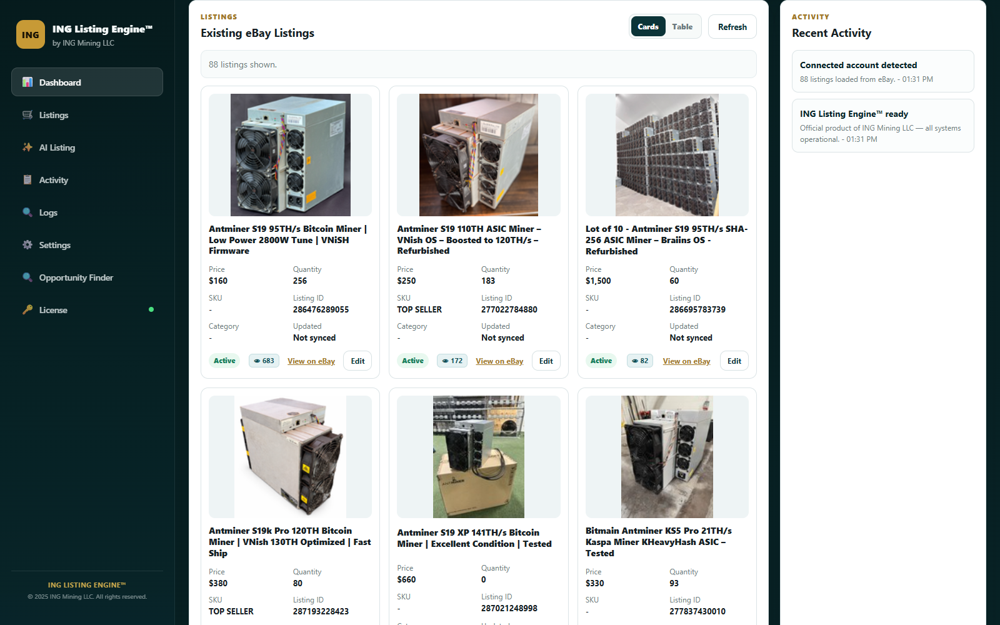

# ING Listing Engine™
### AI-Powered eBay Listing Automation & Software by ING Mining LLC

**Automate eBay listing creation with AI.** Paste a product URL, drop in a photo, or import a whole supplier catalog — Claude AI reads it and fills your title, description, category, item specifics, pricing, and shipping automatically. Then use the built-in **Opportunity Finder** to scan real eBay sold-comp data and surface underpriced auctions, high-sell-through categories, and profitable dropship products before you ever list them.

Built for high-volume eBay sellers who are tired of typing the same listing fields by hand.

---

## Download & Install

👉 **[Download the Installer → ING-AutoLister-Setup.msi](https://github.com/essquireo0o/eBayAutoLister/releases/latest/download/ING-AutoLister-Setup.msi)**

1. Download and run `ING-AutoLister-Setup.msi`
2. Approve the admin prompt — it installs the app and adds it to startup for the logged-in user
3. Your browser opens automatically at `http://localhost:9332`
4. Enter your API keys in Settings and you're ready

> Windows only. The app runs as you (the logged-in user), not as a background Windows service, and auto-starts on login — a tray icon lets you open or quit it any time.

---

## What's New

- **Opportunity Finder** — scan eBay for underpriced auctions, low-competition categories, and high sell-through products using real sold-comp pricing data, with a built-in Supplier File Analyzer that reads a wholesale price list and estimates dropship profit per item.
- **Runs as the logged-in user** — no more leaving a console window open, and no background Windows service; ING AutoLister installs like a proper desktop application and auto-starts on login. Running as you (not LocalSystem) is what lets the Terapeak browser login work.
- **Branded app icon** — the taskbar, Desktop, and Start Menu icons now match the ING Mining brand instead of a generic default.

---

## Features

### Dashboard — Your Whole eBay Store at a Glance

See active listing count, total inventory quantity, catalog value, and items needing review the moment you open the app. Existing eBay listings load automatically as photo cards, and the Recent Activity feed shows exactly what the app is doing in real time.

---

### AI Listing Editor — Paste a URL, Photo, or Product Name

Three ways to start a listing, all AI-driven:
- **AI Product Research** — type a product name and the AI finds photos, specs, and sold prices, then builds a complete listing from scratch.
- **Import From URL** — paste any supplier, manufacturer, Amazon, Alibaba, or eBay listing link and the AI extracts everything.
- **Bulk Catalog Import** — paste a category or collection page URL and generate listings for every product on it automatically.

Every field — title, subtitle, category, item specifics, condition, description, pricing, and shipping — is pre-filled in seconds. The **AI Listing Assistant** can also rewrite anything on demand: "shorten the title," "lower price 10%," "optimize for SEO."

---

### Opportunity Finder — Find What's Worth Listing Next

Before you source or list a product, know whether it's actually worth it:
- **Supplier File Analyzer** — drop in a wholesale price list or product photo and the AI checks every item against real eBay sold-comp data to estimate dropship profit.
- **Keyword & seller search** — cross-references live auctions ending soon against recent sold prices for the same keyword, surfacing high-demand items priced well below where they typically sell.
- **High sell-through, low competition, and underpriced auction detection** — built directly from your own pricing history as you use the app.
- **Seasonal demand guidance** — what's trending now and what's coming next month.

---

### Listings — Manage Your Whole Inventory

Browse every listing already on your eBay account in card or table view — photo, price, quantity, SKU, view count, and sync status at a glance. Click through to edit any listing directly, or jump straight to it on eBay.

---

### Freeware — No Subscription, No Expiry

ING Listing Engine™ is **freeware**. All features are unlocked with no time limit and no subscription required.

Activate with key **`ING-BETA-2025`** in the License page to enable everything.

---

## First-Time Setup

### Step 1 — Get an Anthropic API Key

The AI that reads product pages and writes your listings runs on Claude.

1. Go to **[console.anthropic.com](https://console.anthropic.com)**
2. Sign up or log in → click **API Keys** → **Create Key**
3. Copy the key (starts with `sk-ant-`)
4. Paste it into **Settings → Anthropic API Key** in the app

> Typical cost: under $0.01 per listing.

---

### Step 2 — Set Up an eBay Developer Account

#### 2a. Create a developer account

1. Go to **[developer.ebay.com](https://developer.ebay.com)**
2. Sign in with your regular eBay seller account
3. Accept the developer agreement if prompted

#### 2b. Create a Production Application

1. Go to **Application Keys** → **Create Application**
2. Name it anything (e.g. `AutoLister`) → select **Production** → **Create**
3. Copy all three keys into the app's Settings:

| eBay Key | Where to paste |
|----------|---------------|
| App ID (Client ID) | Settings → eBay App ID |
| Dev ID | Settings → eBay Dev ID |
| Cert ID (Client Secret) | Settings → eBay Cert ID |

#### 2c. Request Full API Access from eBay

> **Important:** By default, new eBay developer accounts are limited to sandbox access only. To publish real listings you must **open a support ticket with eBay** to request production API access for your application.
>
> 1. Log in to **[developer.ebay.com](https://developer.ebay.com)**
> 2. Click **Support** → **Open a Case**
> 3. Request: *"Production API access for my application — I am a registered seller and want to use the Sell API to create listings programmatically."*
> 4. eBay typically approves within 1–3 business days

#### 2d. Set Up Your OAuth Redirect (RuName)

1. In the developer portal, go to **User Tokens**
2. Click **Get a Token from eBay via Your Application**
3. Under **Your auth accepted URL**, add your OAuth callback URL
4. Copy the **RuName** shown → paste into **Settings → eBay RuName**

#### 2e. Connect Your eBay Seller Account

1. Fill in App ID, Dev ID, Cert ID, and RuName in Settings
2. Click **Connect eBay Account** — a browser window opens
3. Log in with your eBay seller account and click **Agree**
4. The app stores your token automatically

> Token lasts 18 months and auto-refreshes. Do this once.

---

### Step 3 — Set Listing Defaults (Optional)

In **Settings → Listing Defaults**, pre-fill your postal code, default handling time, package weight/dimensions, and seller policies so they appear automatically on every new listing.

---

## How to Use

### Single Product
1. Click **AI Listing** → paste any product URL, photo, or product name → click **Analyze** or **Auto-Fill**
2. AI fills everything in ~10 seconds
3. Review and edit if needed → click **Publish to eBay**

### Bulk Import
1. Click **AI Listing** → paste a **collection or category page URL** into the Bulk Catalog Import bar
2. Click **Import All** — each product opens as a tab
3. Review and publish each tab

### Finding What to List
1. Click **Opportunity Finder** → search a keyword or drop in a supplier price list
2. Review sell-through, competition, and pricing signals for each result
3. Send the winners straight into the AI Listing editor

### Managing Drafts
- **Save Draft** — saves locally before publishing
- **Open All Drafts** — reloads previously saved drafts
- **Clear All** — wipes all drafts and tabs to start fresh

---

## Troubleshooting

**App doesn't open in browser**
- Try opening `http://localhost:9332` manually
- Check that **AutoListerB1.exe** is running (Task Manager) — look for the ING tray icon; it auto-starts on login

**eBay token expired**
- Settings → click **Connect eBay Account** again

**AI analysis fails**
- Check your Anthropic API key is correct in Settings
- Verify you have credits on your Anthropic account

**Publish fails with "Developer account not authorized"**
- You need to open a ticket with eBay to enable production API access (see Step 2c above)

**Uninstalling**
- Use **Add or Remove Programs** → **ING AutoLister** → Uninstall, or run `Uninstall-INGAutoLister.bat`

---

## Built With

- [Claude AI](https://anthropic.com) — product analysis, listing generation, and opportunity scoring
- [eBay Sell API](https://developer.ebay.com) — listing creation and publishing
- ASP.NET Core 10 — backend server, running as a tray app under the logged-in user
- Vanilla JS — frontend UI

---

*ING Listing Engine™ is a product of ING Mining LLC. All rights reserved.*
